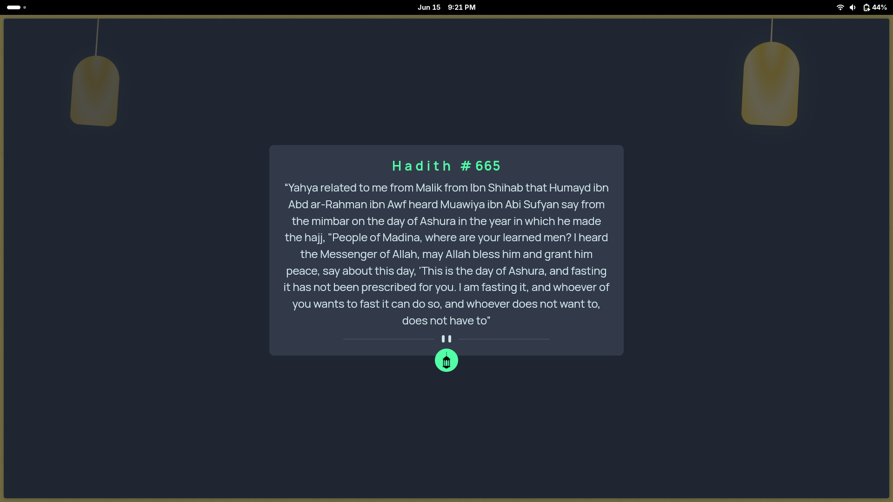

# Hadith Display App

## Welcome! 👋

This is a Hadith display application inspired by the Frontend Mentor advice generator challenge, modified to showcase beautiful Islamic teachings through authentic Hadith.

## About the App

This application displays authentic Hadith (sayings and teachings of Prophet Muhammad ﷺ) in a beautiful, responsive interface. Users can explore different Hadith to gain spiritual guidance and Islamic wisdom.

Your users can:

- View the optimal layout for the app depending on their device's screen size
- See hover states for all interactive elements on the page
- Get a new Hadith by clicking the dice icon
- Read authentic Islamic teachings in a clean, modern interface

## Features

- **Responsive Design**: Works perfectly on desktop, tablet, and mobile devices
- **Interactive UI**: Smooth hover effects and transitions
- **Authentic Hadith**: Powered by verified Islamic teachings
- **Clean Typography**: Easy-to-read design for both Arabic and English text

## Hadith API

This application uses the [Hadith API](https://github.com/fawazahmed0/hadith-api) created by fawazahmed0, which provides access to authentic Hadith from various reliable Islamic sources including Sahih Bukhari, Sahih Muslim, and other verified collections.

## Getting Started

1. Clone this repository
2. Open `index.html` in your browser
3. Click the lamp icon to display different Hadith
4. Enjoy reading the beautiful Islamic teachings

## Deployment

This app can be deployed on:

- [GitHub Pages](https://pages.github.com/)
- [Vercel](https://vercel.com/)
- [Netlify](https://www.netlify.com/)
- Any static hosting service

---

**May Allah accept this effort and make it beneficial for the Ummah. Ameen.** 🤲

**Built with ❤️ for the Islamic community**